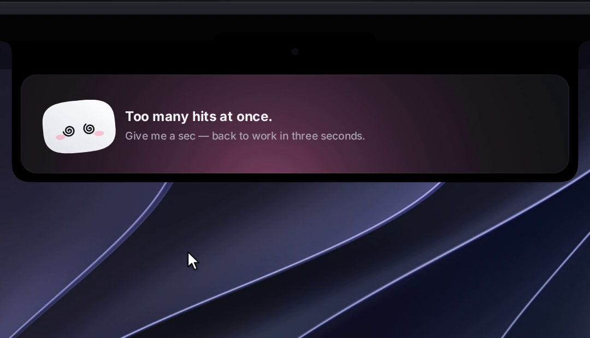

# NimNim

**A tiny friend that lives in your Mac's notch — or at the top of your screen on Windows and Linux — and keeps an eye on your AI coding agent sessions.**

Approve permissions, watch your agents work, drop a file, chat with Claude — all without leaving what you're doing.

---

## Why

Some studios showed off gorgeous notch companions… and never let anyone use them.
**NimNim is different.** A fully animated character with outfits, auras, eye tracking, and deep integrations with your coding tools.

Meet **NimNim**: a soft little squircle with big eyes that pops out of your notch, waves hello, follows your cursor with its eyes, gets annoyed when you poke it (and dizzy if you insist), and tells you the moment Claude Code needs you.

## Features

- 🤖 **Claude Code, Cursor, Codex, Gemini CLI, Antigravity and other agents, live** — see every session in your notch: what it reads, edits and runs, step by step. Tag a hook payload with `nimnim_agent` to give any agent its own pill (see [`docs/AGENTS.md`](docs/AGENTS.md)). Finished? NimNim does a happy little jump.
- See what Claude is editing, live in the notch: each file modification shows the file name and +N −M counts in the ticker, tap to read the full diff
- ✅ **Approve and answer from the notch** — Claude Code permission requests show up with **Allow / Deny / Always**; `AskUserQuestion` prompts show the choices right in the notch (single or multi-select, up to 4 questions). One click, or "Reply in terminal" to fall back to the CLI. Codex also gets Allow / Deny.
- 🧑‍💻 **Jump to the right terminal** — open the exact terminal window of a session *(macOS)*.
- 💬 **Chat with Claude, Gemini, OpenAI, or a local model (Ollama / LM Studio)** — click the model name above the chat box to switch provider and pick a model. Cloud providers use your own API key; local providers connect to a server running on your Mac. *(Gemini, OpenAI and local models: macOS)*
- 📊 **Claude plan usage** *(macOS, GitHub build)* — a small pill in the notch header shows your 5-hour and weekly Claude plan limits. Enable it from Settings → Agents → Plan usage. Pro and Max plans only.
- 📋 **Declare the tools you use** — open Settings → Active pills and pick your main workspace tool (VS Code, Cursor, Codex or Antigravity), then toggle up to 4 more: Gemini CLI, Anthropic, Google AI, OpenAI, Ollama, LM Studio and service integrations *(macOS)*.
- 📎 **Drop a file on the notch** — NimNim turns into a box and swallows it, then ask a question about it or send it by email *(email: macOS, Mail.app)*.
- 🖥️ **NimNim on the desktop** — drag NimNim out of the island to set him loose on your desktop: he floats as a 120 pt companion, follows your cursor, wears his outfit, reacts to alerts by flying home and flying back, and comes back where you left him on next launch.
- 🪟 **Drag NimNim onto any window** — attach that window as context for Claude *(macOS)*.
- 🔌 **Integrations** — Stripe payments, n8n workflows, GitHub (open PRs, reviews requested, CI status), Vercel deployments, Resend emails, Notion, Cal.com. Each one gets its own little colored NimNim.
- 🎵 **Apple Music pill** *(macOS, GitHub build)* — add the Apple Music pill in Settings → Active pills to see what's playing and control playback from the notch; NimNim dances while it plays.
- 👗 **Dress NimNim up** — right-click him for the wardrobe. He also dresses up for the seasons on his own.
- 🎭 **A real character** — idle breathing, blinks, eyes on a sphere that follow your mouse, emotes, 28 handcrafted sounds, a greeting on launch.
- 🫥 **Invisible when idle** — hides away when nothing is running, peeks out when you hover the notch (the top edge of the screen on Windows and Linux).
- 🖥️ **Any Mac, notch or not** — on an iMac, a Mac mini, or a MacBook with its lid closed on an external display, NimNim sits in a small bar at the top of the screen.
- 🔒 **Private by design** — no telemetry, no account. Keys live in your macOS Keychain, Windows Credential Manager or Linux Secret Service (GNOME Keyring, KWallet). The app only talks to the services you plug in.

<table>
<tr>
<td></td>
<td></td>
</tr>
<tr>
<td></td>
<td></td>
</tr>
</table>

## Setup

Click the NimNim icon in the menu bar (macOS) or in the system tray (Windows, Linux) → **Settings…**

| What | Why | Where the key goes |
|---|---|---|
| **Claude Code hooks** | live sessions and approvals | **Install hooks** — NimNim backs up `~/.claude/settings.json`, merges its hooks and shows you the diff before writing anything |
| **Claude plan** *(macOS, GitHub build)* | Plan usage gauge in the notch header | **Install relay** in Settings → Agents → Plan usage, then enable "Show in the notch" |
| **Gemini CLI hooks** *(macOS)* | Gemini CLI sessions in the island | **Install hooks** in Settings → Gemini CLI — backs up `~/.gemini/settings.json` |
| **Antigravity (agy) hooks** *(macOS)* | agy sessions in the island | **Install hooks** in Settings → Antigravity — backs up `~/.gemini/config/hooks.json` |
| **Anthropic API key** | chat and questions about files | Settings → Anthropic API · Keychain / Windows Credential Manager / Secret Service |
| **Google AI API key** *(macOS)* | chat with Google AI (Gemini) | Settings → Chat — other providers · Keychain |
| **OpenAI API key** *(macOS)* | chat with OpenAI | Settings → Chat — other providers · Keychain |
| **Ollama server** *(macOS)* | chat with local models via Ollama | Settings → Chat → Local models → **Connect** |
| **LM Studio server** *(macOS)* | chat with local models via LM Studio | Settings → Chat → Local models → **Connect** |
| **Active pills** *(macOS)* | choose which tools and agents appear in the island | Settings → Active pills |
| Stripe, n8n, GitHub, Vercel, Resend, Notion, Cal.com | the service pills | Keychain / Windows Credential Manager / Secret Service, all optional |

If NimNim isn't running, the hook exits immediately: **Claude Code is never blocked.**

## Things to try

| Do this | NimNim does that |
|---|---|
| Hover the notch (top edge on Windows and Linux) | peeks out and says hi 👋 |
| Click it | opens |
| Hover NimNim | blinks, eyes grow |
| Click NimNim | squish + annoyed |
| Click 3 times fast | 😵‍💫 dizzy for a few seconds |
| Drag a file onto the island | turns into a box and swallows it |
| Drag NimNim onto a window *(macOS)* | attaches it as context |
| Click the model name above the chat box *(macOS)* | switch AI provider or model |

## How it works

**macOS**

- **Island**: a borderless `NSPanel` hugging the notch, driven by a small state machine (`hidden → petit → home`).
- **Character**: drawn in SwiftUI `Canvas` + `TimelineView` at 60 fps — squircle body, eyes projected on a sphere, spring animations. No Rive, no Lottie, no images.
- **Claude Code**: a tiny `nb-hook` script receives hook events and forwards them over a Unix socket to the app. For approvals it waits for your click, then answers the hook.
- **Integrations**: lightweight pollers, paused when nothing is watching.
- **Declared pills**: `PillCatalog.swift` is the single source of truth — every pill (coding tools, agents, AI providers, services) is declared there with its ID, color and category.
- **Sounds**: 28 short WAVs played through preloaded `AVAudioPlayer`s.

The macOS app is native Swift 6 / SwiftUI / AppKit with **zero third-party dependencies**.

**Windows**

- A [Tauri 2](https://tauri.app) app (Rust + TypeScript): the island is a transparent, always-on-top window that never steals focus, NimNim is drawn in Canvas 2D with the same shapes, timings and sounds as on the Mac.
- Claude Code hooks go through a tiny `nimnim-hook.exe` and a named pipe; keys live in Windows Credential Manager.
- Details and differences in [`windows/README.md`](windows/README.md).

**Linux**

- The same Tauri app as Windows. On Wayland the island is a gtk-layer-shell
  overlay anchored to the top edge, and click-through is its input region.
- Claude Code hooks go through the same `nimnim-hook`, over a Unix socket in
  `$XDG_RUNTIME_DIR`; keys live in the Secret Service.

## License

**All Rights Reserved.** See [LICENSE](LICENSE) and [LICENSE-ASSETS.md](LICENSE-ASSETS.md).

This software is proprietary. You may view the code on GitHub and run it on your own device for personal evaluation only. No copying, modifying, distributing, forking, or commercial use is permitted.

**If NimNim made you smile, a ⭐ helps a lot.**

